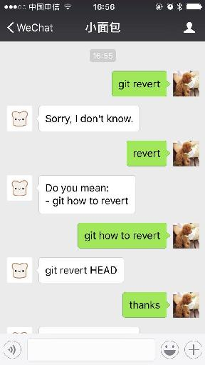

# Bread-AI V1.0.6

## Overview
* Bread-AI is a pure-Python chatbot with artificial intelligence, based on WeChat platform, to help people live better. 

## Folder explain
* console.py: The console of Bread-AI for testing on the terminal.
* core/: Contains the core code of Bread-AI
* data/: Contains the data of Bread-AI
* run.sh: The main running script
* server/: The Django code work for WeChat platform

## Quick start
* Make sure you have installed python3, django, pyaml and pydblite.
* Run console.py to talk with Bread-AI.

## Add data
* See the RAEDME file in data folder. 

## Add super user
* Super user could get more server.
* Edit server/wechat/views.py, add the wechat user id to super_users in _is_super() function.
* Where to get your wechat user id? Just check the post message then you will find it.

## Connect to WeChat platform
* Edit server/server/settings.py, add your public ip address to ALLOWED_HOSTS, For example:
>ALLOWED_HOSTS = [
>    '11.75.120.83',
>]
* Add your public ip address and port number to run.sh, and make sure your port is open to the public network, then execute run.sh to start the Django server.
* Login https://mp.weixin.qq.com/, finish connecting to your server.

## Extra functions
* Enter "help" to see this functions' explaination.
* Tip: your should install "sdcv" before you can use the dictionary function.

## Debug
* The dialogues will store in data/log.txt

## To know more
* Author: Mark Young
* WeChat Official Accounts: Bread-AI
* Email: ideamark@qq.com
